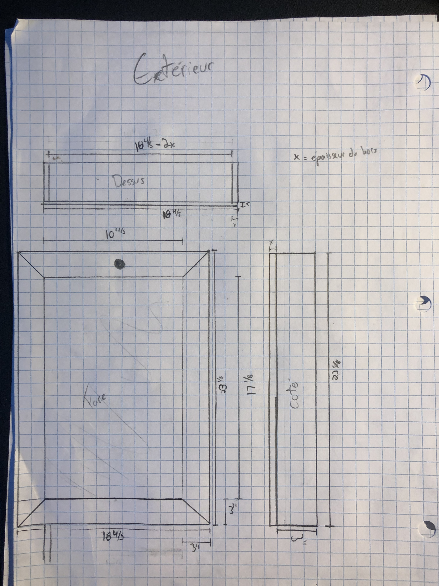
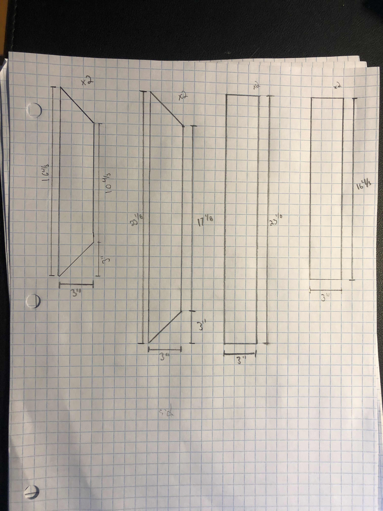
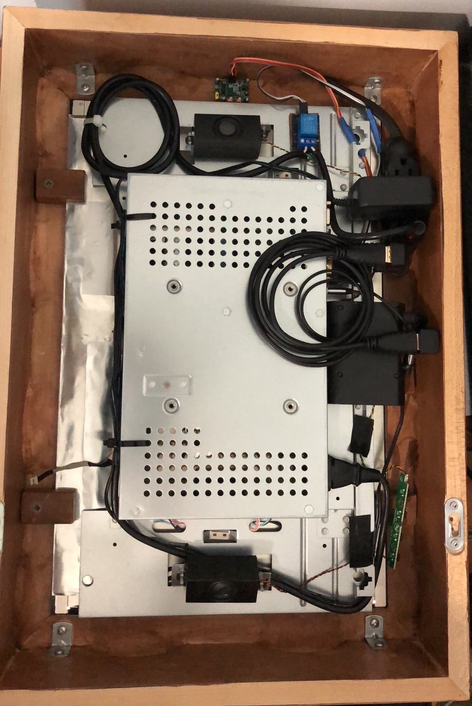
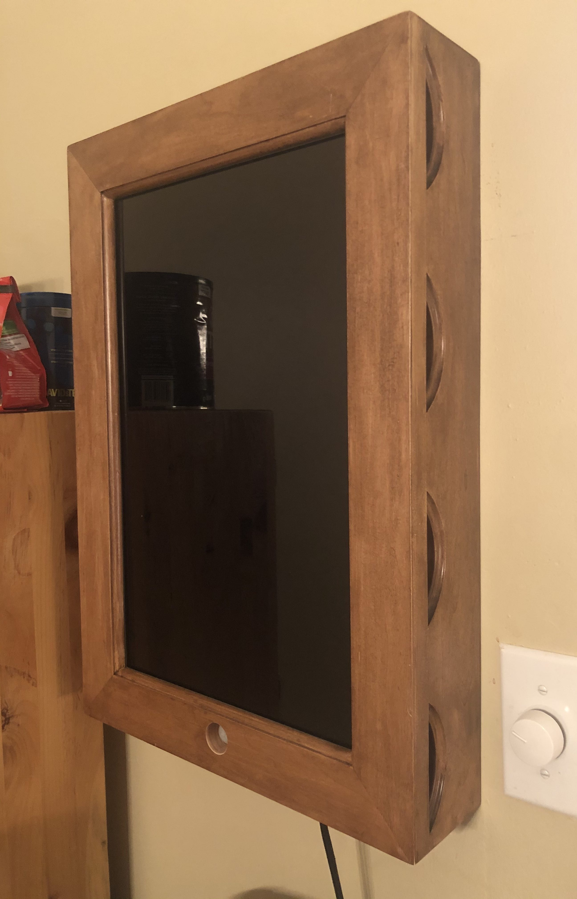
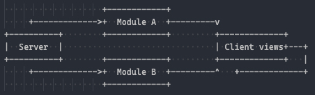

+++
title = "So I built a smart mirror using Elixir"
description = """
A couple of years ago I heard about this thing called a "Smart Mirror". Lots of geeks online were building those by putting a PC monitor in a frame, setting up MagicMirror on a Pi, and voilà. I found the project interesting but my lack of "money" kept me back.

Now I don't have that much more money, but I do have a monitor that I won't be using anymore, a Raspberry Pi, and a father that is used to woodworking.
"""

[extra]
tags = ["phoenix", "elixir", "liveview", "smart", "mirror"]
+++
A couple of years ago I heard about this thing called a "Smart Mirror". Lots of geeks online were building those by putting a PC monitor in a frame, setting up MagicMirror on a Pi, and voilà. I found the project interesting but my lack of "money" kept me back.

Now I don't have that much more money, but I do have a monitor that I won't be using anymore, a Raspberry Pi, and a father that is used to woodworking.

## Sketching up

### The frame

So I sketched something to have an idea of what I really wanted. I drew the overall shape of the frame with the required parts. While making it we adjusted some measures so ones from the sheets are not the same as what it is in reality.

  <a class="image" href="frame_plan_2.jpg">
    <figure>
      
      <figcaption>Full plan</figcaption>
    </figure>
  </a>
  <a class="image" href="frame_plan_1.jpg">
    <figure>
      
      <figcaption>Parts</figcaption>
    </figure>
  </a>

We anticipated some heating issues with the monitor being in a completely closed frame. My father had design and solidity concerns about drilling holes in it. It turned out that my father had some wood plank with arcs in them which is quite perfect for our use case. What I wanted was not really a "Mirror" but more an information dashboard with the weather, calendar, and other stuff. So I gave up the mirrored pane covering the monitor, I'm not that pretty anyway.

### The hardware

Basically, I have everything I need to be working and having something up. Even though I don't have the frame built yet I can still play around with everything. I flashed Raspbian on my Pi, installed [MagicMirror2](https://magicmirror.builders/) on it, and configured it. It was running sweet and everything but I wasn't a fan of the design and how it is configured. As a developer I like **building** software, not **configure** software, but we will talk about this later. The [monitor](https://support.hp.com/ca-en/document/c00908010) I used is a VGA/DVI only monitor that I hooked up with an HDMI to DVI cable to the [Raspberry Pi 3](https://www.raspberrypi.org/products/raspberry-pi-3-model-b/).

What would've been a problem is having the monitor on all the time, it's useless energy consumption and would be pretty annoying at night. I ordered a [PIR Sensor](https://www.amazon.ca/Oiyagai-HC-SR501-Pyroelectricity-Infrared-Detector/dp/B0757JN66G/ref=sr_1_6?dchild=1&keywords=PIR+Motion+Sensor&qid=1605300926&sr=8-6) to add more magic into it.

#### See you, see me

It's nice that I can see my mirror, but it would be even better if he could be seeing me. I plugged the PIR sensor into the Pi and tried to configure it.

I say "tried" because it didn't go well... If I understood well, what was happening is that the DVI to HDMI adapter was preventing the correct sleep/wake of the monitor. I thought about just setting the screen to black but that isn't energy economic. I still don't have a complete understanding of what was happening and didn't want to trial and error for hours so I had another idea.

I hooked up a relay to the PI to control the power cable of the monitor and I wrote [some scripts in NodeJS to handle it](https://github.com/nicklayb/snowhite-pi). It watches for change in the PIR and when it detects motion it shuts off the relay. I set it to normally close because when the Pi starts, there is no signal to the relay, having it on NC mode makes it open by default when the pi starts.

I'm pretty satisfied with I have so far, I even decided to add some interesting fun feature like a connection with my Homebridge server so I can control it Apple Home and shut it down by automation. I don't use it that much but is pretty cool.

  <a class="image" href="mirror_back.jpg">
    <figure>
      
      <figcaption>Interior of the mirror</figcaption>
    </figure>
  </a>
  <a class="image" href="mirror_front.jpg">
    <figure>
      
      <figcaption>Front of the mirror</figcaption>
    </figure>
  </a>

### The software

<a class="image" href="https://raw.githubusercontent.com/nicklayb/snowhite/master/demo.gif">
  <figure>
    
    <figcaption>Software demo</figcaption>
  </figure>
</a>

Now the interesting part. The MagicMirror system was running fine but, as I mentioned, I prefer to be building stuff instead of configuring stuff. And what I love the most to build software is [Elixir](https://elixir-lang.org/). This thing is so cool for its concurrency capabilities, its functional paradigm, and its fault tolerance. So I went and built a smart mirror framework called [Snowhite](https://hexdocs.pm/snowhite). A quite basic framework for now but has some interesting features. MagicMirror is installed on the frontend with an Electron app that runs on the device, even though it can run on a server mode, it uses at least 1Gb of space for it to run while with an OTP release, we talk about 70Mb.

#### LiveView

There is something that exists in Phoenix's ecosystem that is called [LiveView](https://github.com/phoenixframework/phoenix_live_view). Basically, it holds some state on the server to dynamically re-render the view through WebSockets. Here, it is perfectly suitable. This allows the frontend to have no javascript at all (but LiveView's setup). So the LiveView will hold some RSS feeds, for instance, and be updated live when the poller fetches new RSS news. It has an issue though if I open 4 instances of the mirror on 4 browsers, I hold 4 times the same state in different processes. So I came out with a Server system that uses PubSub.

#### Servers

<a class="image" href="server_diagram.png">
  <figure>
    
    <figcaption>Server diagram</figcaption>
  </figure>
</a>

The use of Server is pretty cool because it becomes the central state of the displayed data, controlling its updates, and sending messages when updates happen. Have the clock, for instance, by having the clock on every LiveView would make multiple views out of sync because their refresh time would not be the same. Having a server that broadcast messages makes one central source that tells every view to render on every tick and it makes every view fully synced.

This allows building multiple modules on their own that listens to the same server. Have again the clock, Snowhite includes a calendar display that also listens on clock server to have the current date and build out the calendar automatically when the date changes. Not only that but allows modules to be talking to each other because they all listen to the same PubSub, just different topics.

#### Profiles

Another goal that I had, which doesn't work by now but this is caused by my limited knowledge of Android, is that I can reuse the same app on multiple platforms. I built a cheap Android tablet to have a tablet somewhere on my desk with a different layout than my mirror one with more personal stuff and oriented for productivity. I have been able to easily build a second profile that uses a different layout that is more adapted to the tablet size by simply writing a Snowhite's profile that is just an Elixir module with some macros. Every used module would be 100% synced with the mirror as they all use the same servers. I even used it to build a Chrome default tab page which is kinda neat.

## Best is yet to come

Now when I have a somewhat good idea to implement in the mirror, it is pretty straight forward and really fun to do. I recently added a Sunset/sunrise module that gives times of sunset and sunrise for today and tomorrow because my girlfriend wanted it. I also prototyped something that shows the latest releases that I have in my Plex server.

I would've love to have a touchscreen monitor instead of the one I own, just because it would've given me so much more capabilities.

Don't be shy, browse [the source](https://github.com/nicklayb/snowhite), check it out, check out [the template](https://github.com/nicklayb/snowhite-template) and have fun playing around with it and building modules for it, I think the API is pretty workable right now.

Merci!
